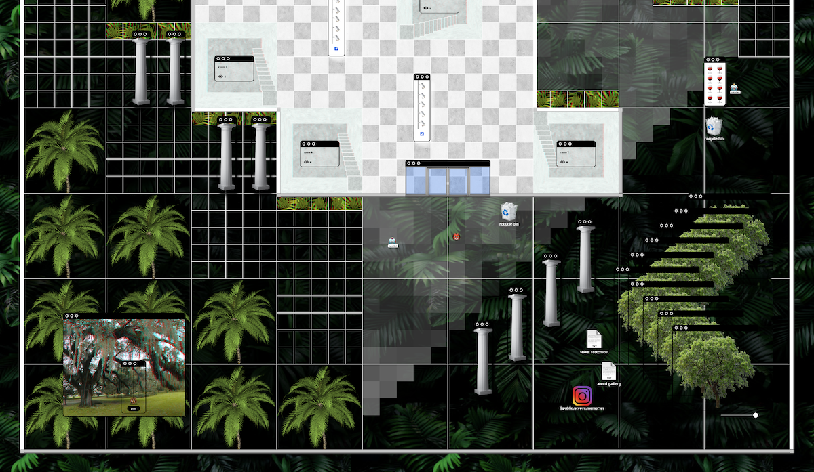

# Public Access Memories Gallery

[Public Access Memories Gallery](https://www.publicaccessmemories.com/) is a digital space to host, curate, analyze, and explore net art and other digital artifacts. Initially created by Jenna deBoisblanc ([@jdeboi](https://www.instagram.com/jdeboi/)), this gallery encourages collaboration! Feel free to suggest features, add changes, iterate, etc...  

This is a MERN stack (although haven't really implemented the mongo database yet..).

[Creative Commons Attribution ShareAlike License](https://creativecommons.org/licenses/by-sa/4.0/)

